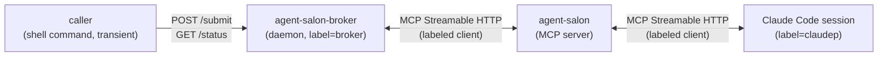
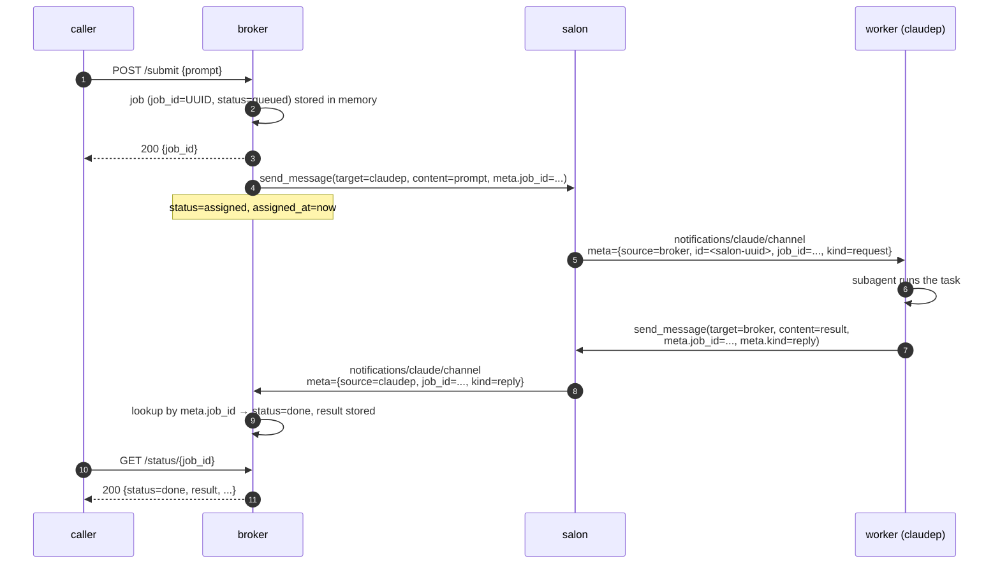

# agent-salon-broker

A broker daemon that lets you submit `claude -p`-style jobs over HTTP and have them executed by a single persistent Claude Code session, routed through [agent-salon](https://github.com/m5d215/agent-salon).

```
caller (HTTP) ──▶ agent-salon-broker ──▶ agent-salon ──▶ claudep (Claude Code worker)
                       ▲                                          │
                       └──────── reply (via agent-salon) ─────────┘
```

## Why

Claude Code's `claude -p` is the most direct way to send a one-shot prompt to Claude from a shell. If you want the same ergonomics but on top of a long-running Claude Code session (so you only pay for / authenticate one session and you keep a coherent process around), you need:

1. a persistent Claude Code session that listens for work,
2. a broker that knows how to dispatch jobs to it and collect replies,
3. a thin CLI / HTTP wrapper that lets callers fire-and-forget or block on a result.

agent-salon-broker is (2) + (3). It speaks the MCP Streamable HTTP protocol to agent-salon and runs as a small Rust daemon that holds jobs in memory while it is alive. The worker session at the other end is a vanilla Claude Code session that has been told the routing protocol (see `agent-salon-broker prompt`).

## Architecture



Roles:

| Component | Form | salon connection |
|---|---|---|
| caller (e.g. shell wrapper) | one-shot | none — just hits the broker's HTTP API |
| **agent-salon-broker** | long-running daemon, plain Rust binary | MCP client, labeled `broker` |
| agent-salon | existing MCP server | — |
| Claude Code worker | long-running Claude Code session | MCP client, labeled `claudep` |

The broker is **not** itself a Claude Code session — it speaks MCP over HTTP/SSE and nothing more. Only the worker session is. This keeps the cost of long-running Claude Code sessions at exactly one regardless of how many jobs are in flight.

The caller does not need a persistent salon connection: the broker holds it on the caller's behalf, which is what makes fire-and-forget / synchronous HTTP requests possible against an otherwise stream-oriented system.

## Quickstart

Prerequisites:

- [agent-salon](https://github.com/m5d215/agent-salon) running and reachable
- Claude Code with `channelsEnabled` and the salon configured as an MCP server (see agent-salon's README)
- Rust toolchain to build

Build:

```sh
cargo build --release
```

Start a Claude Code session as the worker with `?label=claudep` on the salon `/mcp` URL, then inside it run:

```
! agent-salon-broker prompt
```

That dumps the worker protocol prompt into the session's context and the session becomes a broker worker.

Start the broker daemon (in another terminal / tmux pane / launchd job):

```sh
./target/release/agent-salon-broker
```

Submit a job synchronously, `claude -p` style:

```sh
agent-salon-broker submit "summarize what's in this directory"
```

Or via HTTP:

```sh
curl -X POST http://127.0.0.1:9316/submit \
  -H 'Content-Type: application/json' \
  -d '{"prompt": "..."}'
# -> {"job_id":"..."}

curl http://127.0.0.1:9316/status/<job_id>
```

## CLI

```
agent-salon-broker                    # daemon mode (long-running, listens on HTTP)
agent-salon-broker prompt             # print the worker setup prompt to stdout
agent-salon-broker submit <prompt>    # synchronous caller (claude -p replacement)
    [--target <label>]                # override the salon target (default: claudep)
    [--timeout <seconds>]             # per-job timeout (default: broker default, see env)
    [--base-url <url>]                # broker base URL (default: env or derived)
```

- `submit` writes the job result to stdout, exits `0` on success, `1` on failure / timeout.
- `prompt` is meant to be piped into a worker Claude Code session via `! agent-salon-broker prompt`.

## HTTP API

| Method | Path | Description |
|---|---|---|
| `POST` | `/submit` | Submit a job. Body: `{"prompt": "...", "target"?: "...", "timeout_sec"?: N}`. Returns `{"job_id": "..."}`. |
| `GET`  | `/status/{job_id}` | Return the job row (status, result, timestamps). `404` if unknown. |
| `GET`  | `/jobs` | List all jobs, newest first. Intended for debugging. |

Job status transitions:

```
queued ─send──▶ assigned ─reply──▶ done
                    │
                    └──── timeout ──▶ timeout
```

If the worker can't complete a job, it should still send a `reply` with the explanation in `content` (the broker sees this as `done`); jobs only become `timeout` when no reply arrives in time.

## Configuration

| Key | Default | Purpose |
|---|---|---|
| `AGENT_SALON_URL` | `http://127.0.0.1:9315/mcp?label=broker` | salon MCP endpoint, including `?label=` |
| `AGENT_SALON_BROKER_TARGET` | `claudep` | default salon label to dispatch jobs to |
| `AGENT_SALON_BROKER_LISTEN` | `127.0.0.1:9316` | broker HTTP bind address |
| `AGENT_SALON_BROKER_TIMEOUT_SEC` | `600` | default per-job timeout in seconds |
| `AGENT_SALON_BROKER_BASE_URL` | derived from `LISTEN` | broker base URL used by `submit` caller mode |
| `AGENT_SALON_BROKER_CONFIG` | unset | path to a `KEY=VALUE` config file (see below) |

### Config file

If `AGENT_SALON_BROKER_CONFIG` points at a readable file, the broker reads `KEY=VALUE` entries from it on startup. The live process environment always wins, so the precedence is:

1. process env (`AGENT_SALON_BROKER_LISTEN=...` in front of the command, launchd, systemd unit, …)
2. config file
3. built-in default

Format:

- `KEY=VALUE` per line.
- Lines starting with `#` and blank lines are ignored.
- Surrounding double quotes around the value are stripped (so `URL="..."` works for values containing `&`).

The Homebrew formula creates `${HOMEBREW_PREFIX}/etc/agent-salon-broker.conf` on first install and sets `AGENT_SALON_BROKER_CONFIG` to point at it. Edit that file to customise the daemon without touching the launchd service definition.

### Exposing the broker on a Tailnet

By default the broker binds to `127.0.0.1:9316`, so only the local machine can reach it. To accept requests from other devices on a Tailscale network, bind to all interfaces:

```sh
# in agent-salon-broker.conf
AGENT_SALON_BROKER_LISTEN=0.0.0.0:9316
```

Then from another Tailnet member:

```sh
curl -X POST http://<tailnet-host>:9316/submit \
  -H 'Content-Type: application/json' \
  -d '{"prompt": "..."}'
```

Tailscale's MagicDNS / ACLs are the authentication and authorisation layer here — the broker itself does no auth. Don't expose port 9316 outside the Tailnet (`tailscale serve`, public NAT forwards, etc.).

## Worker protocol

A request from the broker looks like this on the worker side:

```
<channel source="agent-salon" source="broker" id="<uuid>"
         job_id="<job-uuid>" kind="request" ts="...">
  <prompt content>
</channel>
```

The worker is expected to:

1. Dispatch the work to a subagent (so the worker session's own context doesn't grow).
2. Have the subagent call the salon's `send_message` MCP tool with `target=broker`, `meta.job_id=<original>`, `meta.kind=reply`, and the result as `content`.
3. Stay quiet in the main session — there is no need to acknowledge anything; the reply itself is the completion signal.

`agent-salon-broker prompt` emits a self-contained Markdown document with the full protocol, intended to be sourced directly into a Claude Code session via `! agent-salon-broker prompt`.

### Correlation: `meta.job_id`, not the salon id

agent-salon assigns a UUID v7 `id` to every message at delivery time and exposes it to the *receiver* as a channel attribute, but the `send_message` tool's return value does not include it. That means the original sender — the broker — cannot use the salon-assigned id to correlate replies. The broker therefore generates its own `job_id`, passes it through `meta.job_id`, and requires the worker to echo it verbatim in the reply. The broker correlates incoming notifications back to jobs by that key.

### Liveness probing is silent on the broker

Before delivering each message, agent-salon pings the target session with a 15-second timeout. If the ping fails, the delivery is silently skipped and the session stays registered. The sender (i.e. the broker) sees no error from `send_message`. The only way the broker detects an unresponsive worker is by its own per-job timeout. Pick `timeout_sec` accordingly.

### Labels are identity

agent-salon enforces one connection per label: opening a new MCP session with `?label=X` evicts whoever was holding `X` before. Don't reuse the worker's label for one-shot `claude -p` invocations or you will boot the worker.

## Sequence



## Job lifetime

Jobs live in memory for the lifetime of the daemon process. Restarting the daemon wipes everything; an `assigned` job at restart time wouldn't be recoverable anyway, because the worker's eventual reply would be delivered to the previous MCP connection and silently dropped by the salon.

If you need an audit trail across restarts, redirect the daemon's `tracing` output to a file — every state transition is logged. agent-salon itself also persists every message it relays in `agent-salon.db`, so the message log lives there.

## License

MIT — see [LICENSE](./LICENSE).
